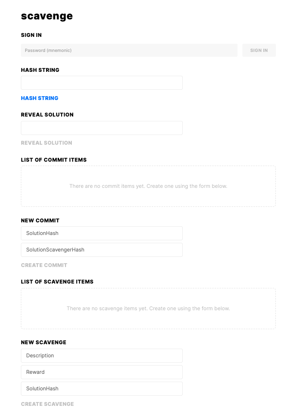
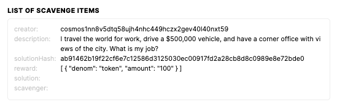
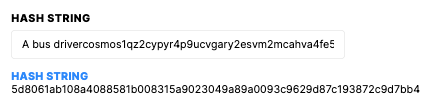
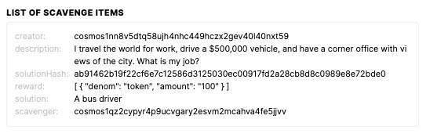

# Play (UI)

At this moment, your UI should look something like this:

We can start by logging in by copying the mnemonic provided by the `starport serve` command and entering it in at the top of the page.

Let's create a new scavenge, using this riddle: 

Q: _"I travel the world for work, drive a $500,000 vehicle, and have a corner office with views of the city. What is my job?"_

A: "A bus driver"

On the bottom of the page, we can see a place to create a new scavenge. Let's copy and paste the description there and add a reward of `100token`.

Next, we'll have to hash the solution using the `Hash String` section at the top. When hashing "A bus driver", we will get the string `ab91462b19f22cf6e7c12586d3125030ec00917fd2a28cb8d8c0989e8e72bde0`. Copy and paste that into the `SolutionHash` field, submit it, and it should look something like this:

Now, we want to refresh the page and sign in as `user2` (the second mnemonic provided), so we can commit and reveal our solution. 

Once we've signed in, we can copy the `SolutionHash` from the list of scavenge items and enter it into the first "New Commit" field.

Based on our implementation of `SolutionScavengerHash`, we will need to hash the solution concatenated with the string of scavenger, like this:

After committing the solution, we should see it appear in the list of commit items, and then we can reveal the solution we submitted by entering in "A bus driver" inside the "Reveal solution" field, and your list of scavenge items should now be updated with the solution as well as `user2`'s address:

